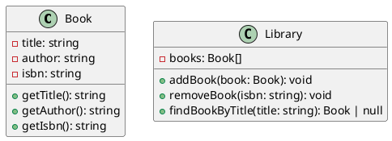

### 練習問題1: シンプルな図書館管理システム

#### クラス図



#### TypeScript 実装

<details>
  <summary>解答を見る</summary>

1. **Bookクラス**

```typescript
class Book {
  private title: string;
  private author: string;
  private isbn: string;

  constructor(title: string, author: string, isbn: string) {
    this.title = title;
    this.author = author;
    this.isbn = isbn;
  }

  getTitle(): string {
    return this.title;
  }

  getAuthor(): string {
    return this.author;
  }

  getIsbn(): string {
    return this.isbn;
  }
}
```

2. **Libraryクラス**

```typescript
class Library {
  private books: Book[];

  constructor() {
    this.books = [];
  }

  addBook(book: Book): void {
    this.books.push(book);
  }

  removeBook(isbn: string): void {
    this.books = this.books.filter(book => book.getIsbn() !== isbn);
  }

  findBookByTitle(title: string): Book | null {
    for (const book of this.books) {
      if (book.getTitle() === title) {
        return book;
      }
    }
    return null;
  }
}
```

</details>

#### 実行例

以下は、上記のクラスを使用した簡単な実行例です。

```typescript
const library = new Library();

const book1 = new Book('The Catcher in the Rye', 'J.D. Salinger', '123456789');
const book2 = new Book('To Kill a Mockingbird', 'Harper Lee', '987654321');

library.addBook(book1);
library.addBook(book2);

console.log(library.findBookByTitle('To Kill a Mockingbird')); // Bookオブジェクトを表示
library.removeBook('123456789');
console.log(library.findBookByTitle('The Catcher in the Rye')); // nullを表示
```