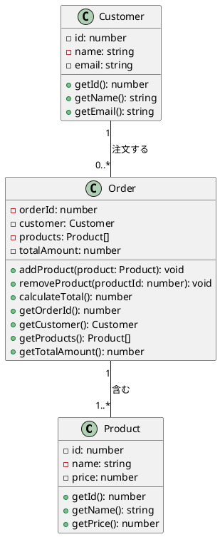

### 練習問題2: オンラインショッピングシステム

次の例題として、もう少し複雑なシステムを考えてみましょう。今回は、オンラインショッピングシステムの一部を実装します。

#### クラス図



#### TypeScript 実装

<details>
  <summary>解答を見る</summary>

1. **Productクラス**

```typescript
class Product {
  private id: number;
  private name: string;
  private price: number;

  constructor(id: number, name: string, price: number) {
    this.id = id;
    this.name = name;
    this.price = price;
  }

  getId(): number {
    return this.id;
  }

  getName(): string {
    return this.name;
  }

  getPrice(): number {
    return this.price;
  }
}
```

2. **Customerクラス**

```typescript
class Customer {
  private id: number;
  private name: string;
  private email: string;

  constructor(id: number, name: string, email: string) {
    this.id = id;
    this.name = name;
    this.email = email;
  }

  getId(): number {
    return this.id;
  }

  getName(): string {
    return this.name;
  }

  getEmail(): string {
    return this.email;
  }
}
```

3. **Orderクラス**

```typescript
class Order {
  private orderId: number;
  private customer: Customer;
  private products: Product[];
  private totalAmount: number;

  constructor(orderId: number, customer: Customer) {
    this.orderId = orderId;
    this.customer = customer;
    this.products = [];
    this.totalAmount = 0;
  }

  addProduct(product: Product): void {
    this.products.push(product);
    this.calculateTotal();
  }

  removeProduct(productId: number): void {
    this.products = this.products.filter(product => product.getId() !== productId);
    this.calculateTotal();
  }

  calculateTotal(): number {
    this.totalAmount = this.products.reduce((total, product) => total + product.getPrice(), 0);
    return this.totalAmount;
  }

  getOrderId(): number {
    return this.orderId;
  }

  getCustomer(): Customer {
    return this.customer;
  }

  getProducts(): Product[] {
    return this.products;
  }

  getTotalAmount(): number {
    return this.totalAmount;
  }
}
```

</details>

#### 実行例

以下は、上記のクラスを使用した簡単な実行例です。

```typescript
const customer1 = new Customer(1, 'John Doe', 'john.doe@example.com');
const order1 = new Order(101, customer1);

const product1 = new Product(1, 'Laptop', 1000);
const product2 = new Product(2, 'Mouse', 50);

order1.addProduct(product1);
order1.addProduct(product2);

console.log(order1.getProducts()); // Productオブジェクトの配列を表示
console.log(order1.getTotalAmount()); // 合計金額を表示

order1.removeProduct(1);

console.log(order1.getProducts()); // 残りのProductオブジェクトの配列を表示
console.log(order1.getTotalAmount()); // 新しい合計金額を表示
```

この問題は、複数のクラスとその間の関係を扱うため、もう少し難易度が上がっています。次のレベルの問題も作成できますので、必要に応じて教えてください。