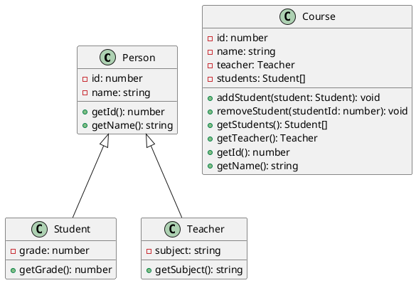

### 練習問題3: 学校管理システム

次の例題として、さらに複雑なシステムを考えてみましょう。今回は、学校の管理システムの一部を実装します。

#### クラス図



#### TypeScript 実装

<details>
  <summary>解答を見る</summary>

1. **Personクラス**

```typescript
class Person {
  protected id: number;
  protected name: string;

  constructor(id: number, name: string) {
    this.id = id;
    this.name = name;
  }

  getId(): number {
    return this.id;
  }

  getName(): string {
    return this.name;
  }
}
```

2. **Studentクラス**

```typescript
class Student extends Person {
  private grade: number;

  constructor(id: number, name: string, grade: number) {
    super(id, name);
    this.grade = grade;
  }

  getGrade(): number {
    return this.grade;
  }
}
```

3. **Teacherクラス**

```typescript
class Teacher extends Person {
  private subject: string;

  constructor(id: number, name: string, subject: string) {
    super(id, name);
    this.subject = subject;
  }

  getSubject(): string {
    return this.subject;
  }
}
```

4. **Courseクラス**

```typescript
class Course {
  private id: number;
  private name: string;
  private teacher: Teacher;
  private students: Student[];

  constructor(id: number, name: string, teacher: Teacher) {
    this.id = id;
    this.name = name;
    this.teacher = teacher;
    this.students = [];
  }

  addStudent(student: Student): void {
    this.students.push(student);
  }

  removeStudent(studentId: number): void {
    this.students = this.students.filter(student => student.getId() !== studentId);
  }

  getStudents(): Student[] {
    return this.students;
  }

  getTeacher(): Teacher {
    return this.teacher;
  }

  getId(): number {
    return this.id;
  }

  getName(): string {
    return this.name;
  }
}
```

</details>

#### 実行例

以下は、上記のクラスを使用した簡単な実行例です。

```typescript
const teacher1 = new Teacher(1, 'Ms. Smith', 'Mathematics');
const course1 = new Course(101, 'Algebra', teacher1);

const student1 = new Student(1, 'Alice', 10);
const student2 = new Student(2, 'Bob', 11);

course1.addStudent(student1);
course1.addStudent(student2);

console.log(course1.getStudents()); // Studentオブジェクトの配列を表示
console.log(course1.getTeacher().getName()); // 教師の名前を表示

course1.removeStudent(1);

console.log(course1.getStudents()); // 残りのStudentオブジェクトの配列を表示
```

この問題は、継承と複数のクラス間の関係を扱うため、さらに複雑になっています。次のレベルの問題も作成できますので、必要に応じて教えてください。