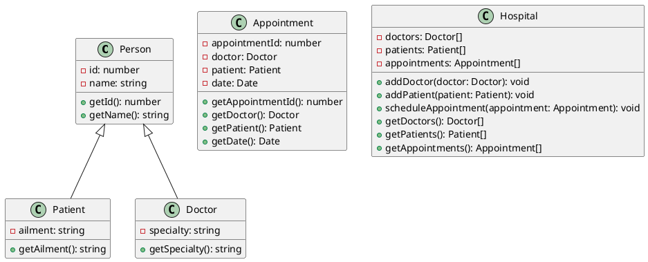

### 練習問題4: 病院管理システム

次の例題として、さらに複雑なシステムを考えてみましょう。今回は、病院管理システムの一部を実装します。

#### クラス図



#### TypeScript 実装

<details>
  <summary>解答を見る</summary>

1. **Personクラス**

```typescript
class Person {
  protected id: number;
  protected name: string;

  constructor(id: number, name: string) {
    this.id = id;
    this.name = name;
  }

  getId(): number {
    return this.id;
  }

  getName(): string {
    return this.name;
  }
}
```

2. **Patientクラス**

```typescript
class Patient extends Person {
  private ailment: string;

  constructor(id: number, name: string, ailment: string) {
    super(id, name);
    this.ailment = ailment;
  }

  getAilment(): string {
    return this.ailment;
  }
}
```

3. **Doctorクラス**

```typescript
class Doctor extends Person {
  private specialty: string;

  constructor(id: number, name: string, specialty: string) {
    super(id, name);
    this.specialty = specialty;
  }

  getSpecialty(): string {
    return this.specialty;
  }
}
```

4. **Appointmentクラス**

```typescript
class Appointment {
  private appointmentId: number;
  private doctor: Doctor;
  private patient: Patient;
  private date: Date;

  constructor(appointmentId: number, doctor: Doctor, patient: Patient, date: Date) {
    this.appointmentId = appointmentId;
    this.doctor = doctor;
    this.patient = patient;
    this.date = date;
  }

  getAppointmentId(): number {
    return this.appointmentId;
  }

  getDoctor(): Doctor {
    return this.doctor;
  }

  getPatient(): Patient {
    return this.patient;
  }

  getDate(): Date {
    return this.date;
  }
}
```

5. **Hospitalクラス**

```typescript
class Hospital {
  private doctors: Doctor[];
  private patients: Patient[];
  private appointments: Appointment[];

  constructor() {
    this.doctors = [];
    this.patients = [];
    this.appointments = [];
  }

  addDoctor(doctor: Doctor): void {
    this.doctors.push(doctor);
  }

  addPatient(patient: Patient): void {
    this.patients.push(patient);
  }

  scheduleAppointment(appointment: Appointment): void {
    this.appointments.push(appointment);
  }

  getDoctors(): Doctor[] {
    return this.doctors;
  }

  getPatients(): Patient[] {
    return this.patients;
  }

  getAppointments(): Appointment[] {
    return this.appointments;
  }
}
```

</details>

#### 実行例

以下は、上記のクラスを使用した簡単な実行例です。

```typescript
const doctor1 = new Doctor(1, 'Dr. Smith', 'Cardiology');
const doctor2 = new Doctor(2, 'Dr. Johnson', 'Neurology');

const patient1 = new Patient(1, 'John Doe', 'Heart Disease');
const patient2 = new Patient(2, 'Jane Doe', 'Migraine');

const appointment1 = new Appointment(101, doctor1, patient1, new Date('2024-07-01'));
const appointment2 = new Appointment(102, doctor2, patient2, new Date('2024-07-02'));

const hospital = new Hospital();
hospital.addDoctor(doctor1);
hospital.addDoctor(doctor2);
hospital.addPatient(patient1);
hospital.addPatient(patient2);
hospital.scheduleAppointment(appointment1);
hospital.scheduleAppointment(appointment2);

console.log(hospital.getDoctors()); // Doctorオブジェクトの配列を表示
console.log(hospital.getPatients()); // Patientオブジェクトの配列を表示
console.log(hospital.getAppointments()); // Appointmentオブジェクトの配列を表示
```

この問題は、複数の継承とクラス間の関係を扱うため、さらに複雑になっています。次のレベルの問題も作成できますので、必要に応じて教えてください。