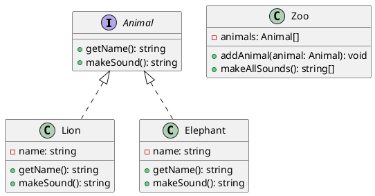

### 練習問題5: 動物園管理システム

継承以外のオブジェクト指向の要素も取り入れた例題を考えてみましょう。
今回は、インターフェースとポリモーフィズムを活用した動物園管理システムを実装します。

#### クラス図




#### TypeScript 実装

<details>
  <summary>解答を見る</summary>

1. **Animalインターフェース**

```typescript
interface Animal {
  getName(): string;
  makeSound(): string;
}
```

2. **Lionクラス**

```typescript
class Lion implements Animal {
  private name: string;

  constructor(name: string) {
    this.name = name;
  }

  getName(): string {
    return this.name;
  }

  makeSound(): string {
    return 'Roar';
  }
}
```

3. **Elephantクラス**

```typescript
class Elephant implements Animal {
  private name: string;

  constructor(name: string) {
    this.name = name;
  }

  getName(): string {
    return this.name;
  }

  makeSound(): string {
    return 'Trumpet';
  }
}
```

4. **Zooクラス**

```typescript
class Zoo {
  private animals: Animal[];

  constructor() {
    this.animals = [];
  }

  addAnimal(animal: Animal): void {
    this.animals.push(animal);
  }

  makeAllSounds(): string[] {
    return this.animals.map(animal => animal.makeSound());
  }
}
```
</details>

#### 実行例

以下は、上記のクラスを使用した簡単な実行例です。

```typescript
const zoo = new Zoo();

const lion1 = new Lion('Simba');
const elephant1 = new Elephant('Dumbo');

zoo.addAnimal(lion1);
zoo.addAnimal(elephant1);

console.log(zoo.makeAllSounds()); // ['Roar', 'Trumpet']を表示
```

この問題は、インターフェースとポリモーフィズムを使用しているため、オブジェクト指向の異なる側面を探求することができます。次のレベルの問題も作成できますので、必要に応じて教えてください。